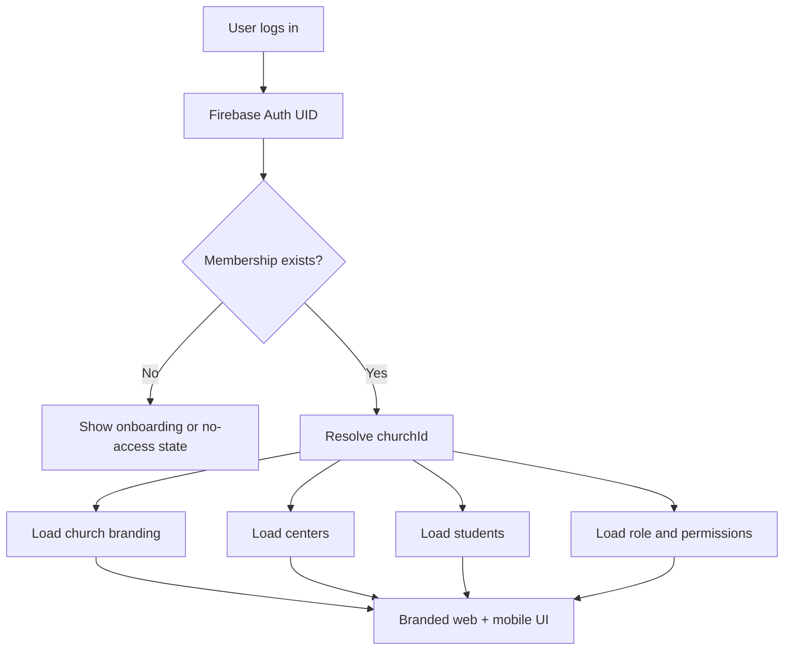
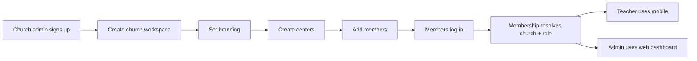

# Sundayclass Full Product Roadmap

## 1. Core Clarification

### Why do env files currently have `hosa`?

Right now `DEFAULT_CHURCH_ID` in env is only a **temporary bootstrap fallback** used during migration from:

- single church app
- to multi-tenant white-label platform

It is **not** the final architecture.

### What should happen in the final product?

The final product should be **dynamic**, not hardcoded.

Correct final flow:

1. user logs in
2. app gets the Firebase `uid`
3. app checks church membership
4. app resolves the correct church
5. app loads:
   - church branding
   - centers
   - students
   - permissions

So yes, your understanding is correct:

> the church should be resolved dynamically after login

### Final membership model

```text
User login -> Firebase UID
          -> churches/{churchId}/members/{uid}
          -> active church resolved
          -> branding + data loaded
```

### Long-term rule

- env fallback should be used only for development/bootstrap
- production behavior should be membership-driven

---

## 2. Product Vision

Sundayclass should become:

- a multi-tenant white-label church platform
- elegant on mobile and web
- easy for teachers and church admins
- flexible for churches with:
  - only church-level Sunday class
  - many centers like `A1`, `A2`, `A3`
- scalable for future modules like events, follow-up, communication, reports, and premium white-label builds

---

## 3. Product Model

## Platform structure

```text
Platform
  -> Churches
    -> Branding
    -> Members
    -> Centers
    -> Students
    -> Attendance
    -> Reports
    -> Spotlight
    -> Settings
```

## Real ministry structure

```text
Church
  -> Center A1
  -> Center A2
  -> Center A3
  -> Church (main location)

Center
  -> Teachers / volunteers
  -> Students
  -> Attendance
```

---

## 4. System Diagram



## Admin + member flow



---

## 5. User Roles

### Platform Admin

- supports the platform
- manages plans and exceptional cases
- does not manually create every church in the normal flow

### Church Admin

- creates and manages their church workspace
- sets branding
- creates centers
- adds members
- manages students and attendance

### Teacher / Volunteer

- logs in to mobile
- views assigned church and centers
- marks attendance
- adds or updates students if permitted
- uses spotlight

### Viewer / Staff

- reads selected data based on role

---

## 6. Product User Stories

## A. White-label onboarding

### Story A1

As a church admin, I want to create my own church workspace, so I do not need platform support to start using the product.

### Story A2

As a church admin, I want to upload logo and branding colors, so the app feels like my church’s product.

### Story A3

As a church admin, I want onboarding steps to be skippable, so I can finish setup gradually.

## B. Membership and access

### Story B1

As a teacher, I want to log in with my own email and password, so my access is personal and secure.

### Story B2

As a church admin, I want to assign a user to my church using their UID and role, so they only see my church’s data.

### Story B3

As a logged-in user, I want the app to automatically detect my church after login, so I do not need manual configuration.

## C. Centers

### Story C1

As a church admin, I want to create centers like `A1`, `A2`, `A3`, or `Church`, so the ministry structure matches real operations.

### Story C2

As a church admin, I want students assigned to centers, so attendance and reporting stay organized.

### Story C3

As a teacher, I want to know which center I am serving, so I can mark attendance quickly.

## D. Students and attendance

### Story D1

As a teacher, I want to mark attendance quickly on mobile, so Sunday workflow stays simple.

### Story D2

As a church admin, I want to view student counts and attendance by center, so I can understand ministry health.

### Story D3

As a teacher, I want to save lesson summary notes, so reports reflect the actual class session.

## E. Branding and white-label

### Story E1

As a church admin, I want website and mobile branding to update from my settings, so my church identity is reflected everywhere.

### Story E2

As a church admin, I want the product to look good even if my logo or colors are different, so white-label branding stays elegant.

## F. Advanced product growth

### Story F1

As a church admin, I want follow-up tools for absent students, so we can care for students better.

### Story F2

As a church admin, I want birthday reminders, so leaders can recognize students.

### Story F3

As a church admin, I want announcements and events, so communication stays in one place.

### Story F4

As a premium church client, I want a custom branded app build, so the installed app icon and splash are also white-labeled.

---

## 7. Full Roadmap

## Phase 1: Foundation Stabilization

### Goal

Finish the multi-tenant core so the product is structurally safe.

### Scope

- church membership-driven access
- remove dependence on hardcoded church env for normal product behavior
- clean legacy collection fallback
- finalize center-based data model
- tighten Firestore rules

### Output

- dynamic church resolution after login
- church-scoped reads only
- no old shared student leakage

---

## Phase 2: White-label Onboarding

### Goal

Make church self-service onboarding complete and polished.

### Scope

- signup
- create church workspace
- branding step
- centers step
- members guidance step
- onboarding completion state

### Output

- self-serve white-label onboarding flow

---

## Phase 3: Role and Membership Experience

### Goal

Make member setup and login smooth.

### Scope

- improve members page UX
- show UID help or self-service copy UID flow
- better role and center assignment
- active/inactive member states

### Output

- church admin can reliably onboard members
- members log in and see only their church data

---

## Phase 4: Core Operations

### Goal

Finish the everyday church workflows.

### Scope

- center management
- student management
- attendance
- session summary
- reports
- spotlight

### Output

- complete usable church operations platform

---

## Phase 5: UI and Design System

### Goal

Make the product feel premium and consistent.

### Scope

- mobile shell
- website shell
- collapsing headers
- better tab bar
- shared component patterns
- empty states
- success states
- motion polish

### Output

- elegant white-label product identity

---

## Phase 6: Advanced Features

### Goal

Expand product depth beyond attendance.

### Scope

- follow-up tracking
- birthday reminders
- announcements
- events
- center-level dashboards
- teacher performance or engagement summary
- export and printable reports

### Output

- platform becomes a fuller church operations suite

---

## Phase 7: Premium White-label Tier

### Goal

Support deeper enterprise/premium church branding.

### Scope

- custom mobile app icon
- splash screen
- custom app name
- custom domain
- optional separate build per church

### Output

- premium true white-label offering

---

## 8. Immediate Next Priorities

## Priority 1

Finish dynamic church resolution completely.

### Why

Because env-based fallback should stop being the normal runtime path.

## Priority 2

Finish center and student cleanup.

### Why

Because wrong center data affects attendance and reports.

## Priority 3

Finish mobile design system cleanup.

### Why

Because the app is improving fast, but shared patterns are still not fully extracted.

## Priority 4

Improve member onboarding UX.

### Why

Because the product depends on correct membership mapping.

## Priority 5

Start advanced modules.

### Why

Because that is where the platform becomes stronger than a simple attendance app.

---

## 9. Recommended Delivery Order

```text
1. Dynamic church resolution
2. Clean tenant-only data reads
3. Centers and students cleanup
4. Member onboarding UX
5. Mobile design-system cleanup
6. Follow-up + birthdays + announcements
7. Premium white-label build pipeline
```

---

## 10. Success Definition

The product is in a strong state when:

- church admin can self-onboard
- branding applies across web and mobile
- each user sees only their church
- centers are managed correctly
- students belong to centers
- attendance is fast on mobile
- reports are clear on web
- advanced modules can be added without breaking the architecture

---

## 11. Current Recommendation

The next engineering and product step should be:

### “Remove hardcoded default church dependency from normal runtime flow”

That means:

- keep env fallback only for local bootstrap/dev
- make membership fully decide church after login
- then continue feature expansion on top of that

